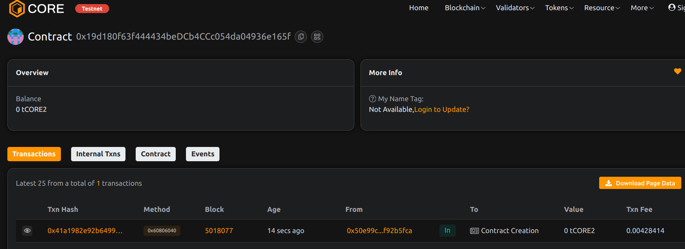

# Project Title: GrantChain: Milestone-Based Dev Grant Vesting  
 
## Project Description                       
     
GrantChain allows developers and funders to interact through structured, milestone-based grant contracts. Funders deposit the full grant amount, which is then released in parts as work milestones are completed.
 
## Project Vision   
 
To create a transparent, milestone-driven funding mechanism for developers and creators, reducing the risk of misallocated grants and incentivizing delivery.
  
## Key Features 
   
- Grantee-controlled wallet address 
- Milestone tracking and fund release 
- On-chain accountability and transparency
- Escrow-like holding for grant security

## Future Scope

- DAO-managed grants with voting on milestone approval
- GitHub/commit-based automated verifications
- Multi-grantee projects and team funding
- Tokenized milestone rewards (NFTs)

## Contract Details
0x19d180f63f444434beDCb4CCc054da04936e165f
  
